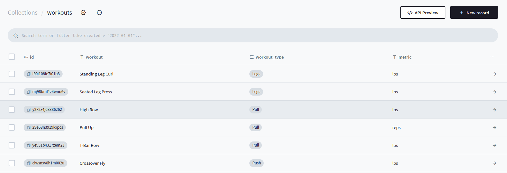

+++
date = '2025-04-30'
draft = false
title = 'I Love PocketBase'
summary = "Using PocketBase to build apps quick"
+++

I've been tracking all of my lifting progress using the notes app on my phone, and while that's held up for about a year, it really isn't able to help me track my progress.

The general format for all of my workouts is this:

"[workout] - [current weight] [whether I went up/down from last week]"

While this helps me track my progress week to week, there is no way for me to look back at my progress from 2 months ago to see where I am.
At the same time I've been working on a professional project using VueJS and SharePoint, so I decided to take the skills I learned with Vue and wanted to build my own workout tracker. While I could have used a simple setup with a MySQL container to store my data, I haaaaaate working with SQL. I've always been interested in services like [Firebase](https://firebase.google.com/) for building out apps quickly, but I refuse to use non-FOSS tools for my projects :).

Let me introduce: PocketBase!

Straight from the PocketBase website: `'PocketBase is a portable backend that offers realtime database, authentication, file storage and admin dashboard. It can be used as a standalone app or as a framework that can be extended with Go and JavaScript hooks.'`

The cool thing is that PocketBase is a flat binary thats only 41MB big.

With that said, lets take a look at how you can store your data with PocketBase.

Below is where I store all of my different types of workouts:



And this is where all of the workout entries are stored:


Note that you can store relationships between entries. For example, the "workout" column in the "workout_entries" collection, has a relationship to the ids in the "workouts" collection.

You can even do views in PocketBase:

```sql
WITH ranked_entries AS (
  SELECT 
    workouts.workout,
    workout_entries.value,
    workouts.workout_type,
    workouts.metric,
    workout_entries.created,
    ROW_NUMBER() OVER (
      PARTITION BY workouts.workout 
      ORDER BY workout_entries.created DESC
    ) AS rank
  FROM workout_entries
  JOIN workouts ON workouts.id = workout_entries.workout
),
comparison AS (
  SELECT 
    curr.workout,
    curr.workout_type,
    curr.metric,
    curr.value AS current_value,
    prev.value AS previous_value,
    CASE
      WHEN prev.value IS NULL THEN 'no_prev_entry'
      WHEN curr.value > prev.value THEN 'higher_weight'
      WHEN curr.value < prev.value THEN 'lower_weight'
      ELSE 'no_change'
    END AS progress
  FROM ranked_entries curr
  LEFT JOIN ranked_entries prev 
    ON curr.workout = prev.workout 
   AND prev.rank = 2
  WHERE curr.rank = 1
)
SELECT 
  (ROW_NUMBER() OVER()) AS id,
  workout,
  workout_type,
  metric,
  current_value,
  previous_value,
  progress
FROM comparison;
```

Will generate this:


The integration with your code is also very simple. The following shows how to instantiate the PocketBase client, and make an API call. In this case, this will call all of the entries for a collection that stores my weight (No I'm not gonna expose how fat I may or may not be...).

pocketBaseClient.ts
```typescript
import PocketBase from 'pocketbase'

let temppb = new PocketBase(`${import.meta.env.VITE_APP_POCKETBASE_URL}`)
temppb.autoCancellation(false)

export const pb = temppb
```
<br />

WeightTable.ts
```typescript
async function getEntries() {
    try {
      const records = await pb.collection('weight_entries').getFullList({
        sort: 'date'
      })
      entries.value = records
    } catch (err) {
      console.log(err)
    }
}
```

With this I can then populate my table!


So yeah, PocketBase has become my new love. It has greater support for user auth (including MFA), backups, file uploads, and batch uploading, so if you're working on a smaller project or need to make a mock, I highly recommend!
