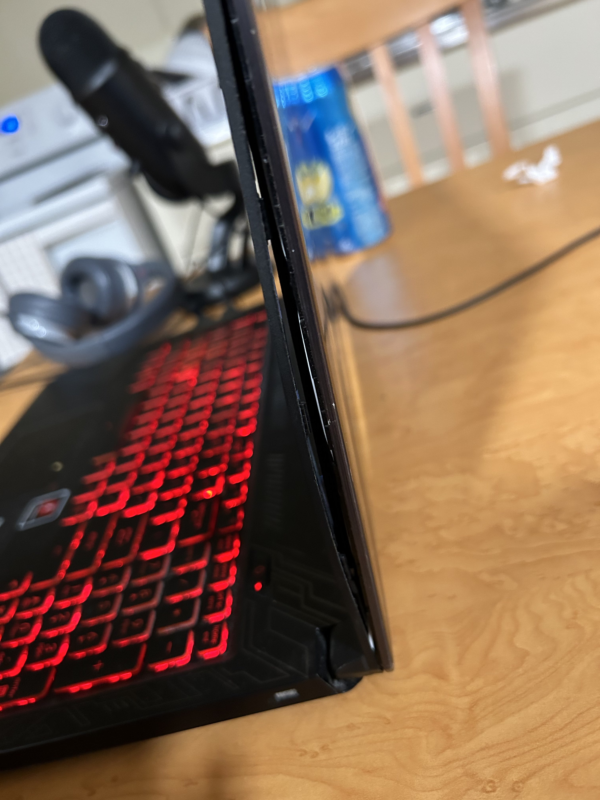

+++
date = '2026-02-21'
draft = true
title = 'Pulumi and Proxmox'
summary = 'Doing CI/CD with Pulumi and Proxmox'
+++

It's time to retire my old gaming laptop. I bought this laptop before I shipped off for basic military training (circa September 2018), and it has served me well. In the past I've had bad experiences with them, but I can say that the ASUS FX504 was a solid laptop for its time. It has a Core i7-8750H, 16GB RAM, and a GTX 1060 Mobile. However, she's shown her age, the trackpad & keyboard barely works, and the frame around the screen is bending, and feels like it's going to fall off. If you look at it from the side you can actually see where the plastic is separating lol.

So instead of putting her out of her misery, I decided to turn her into my second Proxmox node!

## Quick Jumps

[Intro To My CI/CD](#intro)

[Infrastructure](#my-home-infrastructure)

[Services](#self-hosted-services)

Now, I've set up Proxmox clusters before, but this one I had to be a bit more careful about, mainly because I'm using an IaC tool called [Pulumi](https://www.pulumi.com/docs/get-started/). In the past I used Terraform, but I switched to Pulumi for it's better state management, and because it lets me bring whatever language I please.