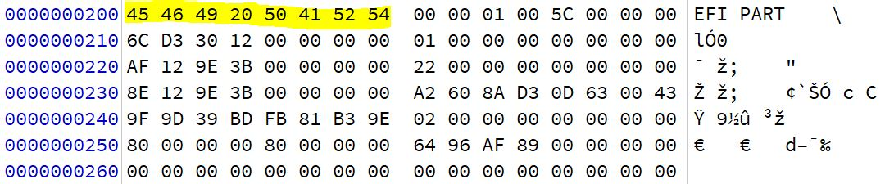

# Understanding Filesystems

### MBR

{% embed url="https://i0.wp.com/knowitlikepro.com/wp-content/uploads/2020/05/3-2.png?resize=903%2C668&ssl=1" %}

{% embed url="https://i0.wp.com/knowitlikepro.com/wp-content/uploads/2020/05/4-1.png?resize=489%2C265&ssl=1" %}
_**MBR Map**_


{% embed url="https://i0.wp.com/knowitlikepro.com/wp-content/uploads/2020/05/6.png?resize=1200%2C681&ssl=1" %}
The Partition Table


List of partition types: [https://www.win.tue.nl/%7Eaeb/partitions/partition\_types-1.html](https://www.win.tue.nl/\~aeb/partitions/partition\_types-1.html)

For more info see: [https://knowitlikepro.com/understanding-master-boot-record-mbr/](https://knowitlikepro.com/understanding-master-boot-record-mbr/)

### GPT


GPT Scheme


The partition is identified by hex value EE, which shows it is a GPT partition disk, as shown in the following GPT hex:

.png>)

Start of the GPT header:

.png>)

### Host Protected Area (HPA)/Device Configuration Overlays (DCO)

HPA and DCO are hidden areas on the hard drive created by the manufacturers. The HPA is used by the manufacturer to store recovery and diagnostics tools and cannot be changed or accessed by the user. The DCO is an overlay that allows the manufacturer to use standard parts to build different products. It allows the creation of a standard set of sectors on a component to achieve uniformity. For example, the manufacturer might use one set of parts to create a 500-GB hard drive, and while using the same components, can also create a 600-GB hard drive.

